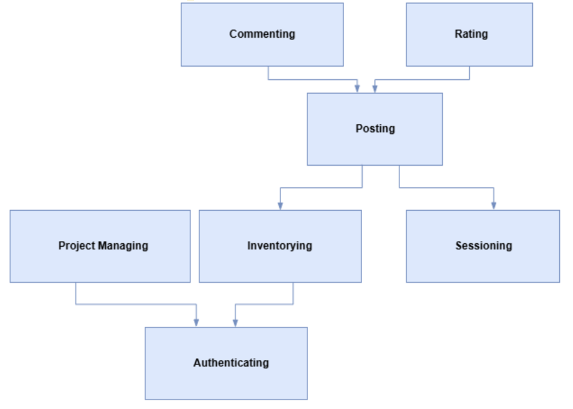
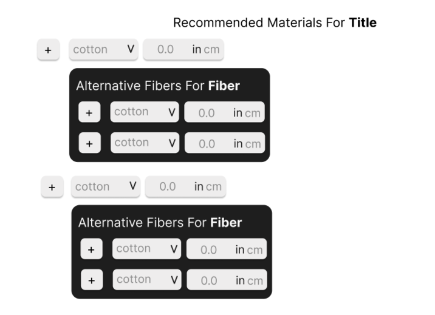
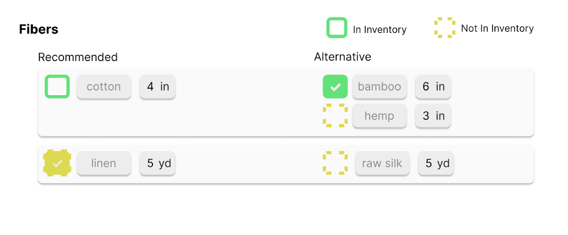

# Convergent Design

## Functional Design

### Concepts

#### Posting[User, Fiber]

**Purpose**

Allow experienced users to share knowledge for projects; allow crafters to find/use the guides for their crafts.

**Operational Principle**

After creating a guide with text, images, and other resources, postGuide will post the guide to be available to everyone, similarly editGuide and deleteGuide would change the guide and delete the guide to be unavailable to others respectively. Other users can view guides from other authors/use specific fibers or random guides.

**State**

    guides: set Guide
    fibers: Guide → Set (Set Fiber)
    content: Guide → String
    author: Guide → User
    tips: Guide → Set String
    mistakes: Guide → Set String

**Actions**

    postGuide(content: String, fibers: Set (Set Fiber), tips: Set String, mistakes: Set String, author: User):
		guides |= (content, fibers, tips, mistakes, author)

	editGuide(guide: Guide, ?content, ?fibers, ?tips, ?mistakes):
		If guide in guides:
			Edit the guide to have new content, fibers, tips, mistakes if given

	deleteGuide(guide: Guide):
		If guide in guides:
			guides -= guide

	getGuidesFrom(author: User, out selected_guides: Set Guide):
		For guide in guides:
			If guide.author == author
				selected_guides += guide

	getGuidesWith(fibers: Set Fiber, out selected_guides: Set Guide):
		For guide in guides:
			usableGuide = True
			For fiberSet in guide.fibers:
				If (all fiber in fiberSet fiber > all fiber in fibers)
					usableGuide = False
			If usableGuide 
				selected_guides += guide

	getRandomGuide(out guide: Guide)
		Select randomly from `guides`

#### Rating[Object]

**Purpose**

Rate objects for easy differentiation for the users

**Operational Principle**

Objects can be given ratings. Then users can find objects with specific rating or objects with rating at least x. Ratings can be updated or deleted.

**State**

    ratings: set Rating
	(object, score): Rating → (Object, float)

**Actions**

    giveRating(object: Object, score: float, out rating: Rating):
		ratings |= (object, score)

	getRating(object: Object, out score: float):
		for rating in ratings:
			If rating.object == object:
				return rating.score

	updateRating(object: Object, score: float):
		for rating in ratings:
			If rating.object == object:
				rating.score = score

	deleteRating(object: Object):
		for rating in ratings:
			If rating.object == object:
				ratings -= rating

	getObjectsWithMinRating(score: float, out selected_rating: Set(Rating)):
		for rating in ratings:
			If rating.score >= score:
				selected_rating += rating

#### Inventorying

**Purpose**

To allow users to keep track and manage their current inventory of different yarns, fibers, and other materials.

**Operational Principle**

A User can add materials they bought to their inventory, remove materials they use for their projects, and see what materials they have a lot or little of.

**State**

    fibers: set Fiber
    fiberName: Fiber -> one String
    fiberBrand: Fiber -> one String
    fiberType: Fiber -> one String
    fiberColor: Fiber -> one String
    fiberImage: Fiber -> one Image
    fiberRemainingYardage: Fiber -> one number

**Actions**

	addNewFiber(name: String, brand: String, type: String, color: String, image:Image, yardage: number, out: Fiber)
		fibers += out
		out.fiberName := name
		out.fiberBrand := brand
		out.fiberType := type
		out.fiberColor := color
		out.fiberImage := image
		out.fiberRemainingYardage := yardage

	editFiberCount(fiber: Fiber, yardage: number)
		fiber.fiberRemainingYardage := yardage

	deleteFiber(fiber:Fiber)
		If fiber in fibers: fibers -= fiber

	getFibersWith(options?:(name, brand, type, color), out: set Fiber)
		For fiber in fibers:
		    #if name, brand, type, or color is null also just set that specific part of the if to be true
                If (fiber.fiberName==name and fiber.fiberBrand==brand and fiber.fiberType==type and fiber.fiberColor ==color):
                    out+=fiber
        return out

#### Project Managing[User]

**Purpose**

To allow users to manage their creative projects by journaling progress, tracking resources, and organizing project details.

**Operational Principle**

Users can create, edit, and delete project entries, including managing notes, links, and images that they may deem useful to their project.

**State**

    projects: set Project
	title: Project → String
	status: Project → String
	dateCreated, dateModified: Project → Date
	notes: Project → String
	links: Project → String
	images: Project → set Image

**Actions**

    createProject (title: String, status: String)
		projects |= (title, status, notes=””, links={}, images={})

	editProject (project: Project, ?title: String, ?status: String)
		If project in projects:
			edit the project to have new title, status if updated
			update dateModified

	deleteProject (project: Project)
		if project in projects:
			projects -= project

	getProjects (out projects: set Project)
		projects = {project for project in projects}

	getNotes (project: Project, out note: String)
		if project in Project:
			note = notes

	editNote (project: Project, content: String)
		if project in projects:
			update content
			update dateModified

	getLinks (project: Project, out links: String)
		if project in Project:
			links = links

	editLinks (project: Project, links: String)
		if project in projects:
			update links
			update dateModified

	getImages (project: Project, out images: set Image)
		if project in projects:
			images = images

	addImage (project: Project, image:Image)
		if project in projects:
			images += image
            update dateModified

	deleteImage (project: Project, image:Image)
		if project in projects:
			images -= image
			update dateModified

#### Authenticating[User]

**Purpose**

To authenticate that the person is in fact a corresponding user in the platform

**Operation Principle**

A person gives a password and a name to get access to a user in the platform with the same name and password

**State**

    users: Set Users
    name: user -> One String
    password: user -> One String

**Actions**

    authenticate(name: String, password: String, out user: User):
        for user in users:
            if user.name == name and user.password == password:
                return user

    register(name: String, password: String):
        if name not in user.name for all user in users:
            user := new User
            user.name := name
            user.password := password
            users += user

#### Sessioning[User]

**Purpose**

To initiate a session in the platform

**Operation Principle**

A user starts a session in the platform and can interact with the platform

**State**

    session: One User
    active: user -> One Boolean

**Action**

    startSession(user: User, out session: User):
        user.active := True
        return user

    endSession():
        if user.active:
            user.active := False

#### Commenting[User, Item]

**Purpose**

To add a comment as a reply to an item.

**Operational Principle**

After uses leaves a comment under an item, other users can see the comment associated with the item.

**State**

	comments: set IDs
	author: comments -> one User
	content: comments -> one String

**Actions**

	addComment(guide: Item,  user: User, content: String):
		Create comment := new ID
		comment.author := user
        comment.content := content
        guide.comments += comment
		
	deleteComment(guide: Item, user: User, content: String):
		guide.comments -= comment
		comment.author := None
        comment.content := None
    
    editComment(comment: ID, user: User, content: String):
        if coment in guide.coments and coment.author == user:
            coment.content := content

### Synchronizations

    app Craftfolio
    include Authenticating
    include Sessioning [Authenticating.User]
    include Inventorying[Authenticating.User]
    include Posting[Authenticating.User, Inventorying.Fiber]
    include Commenting[Posting.Guide, Authenticating.User]
    include ProjectManaging [Authenticating.User]
    include Rating[Posting.Guide]

    sync register(username, password: String, out user: User)
        Authenticating.register(username, password, user)

    sync login(username, password: String, out user: User, out session: Session)
        Authenticating.authenticate (username, password, user)
        Sessioning.start(user, session)

    sync authenticate(session: Session, out user: User)
        Sessioning.getUser(session, user)

    sync logout(session: Session)
        Sessioning.end(session)

    sync postGuide(user: User, 
        content: String, 
        fibers: set (set Fiber), 
        tips: set String, 
        mistakes: set String, 
        out guide: Guide, 
        out rating: Rating
        )
        Posting.postGuide(content, fibers, tips, mistakes, user)
        Rating.giveRating(guide, someScore)

    sync editGuide(guide: Guide, ?content, ?fibers, ?tips, ?mistakes)
        Posting.editGuide(guide, content, fibers, tips, mistakes)
        Rating.updateRating(guide, newScore)

    sync importGuide(user: User, guide: Guide, out project: Project)
        title = title of the guide
        ProjectManaging.createProject(title, “To Do”)
        guideLink = link of the guide
        ProjectManaging.editLinks(project, guideLink)
        for fiber in guide.fibers:
            Inventorying.editFiberCount(fiber, amount)

    sync getTopGuides(minScore: float, out guides: set Guide)
        Rating.getObjectsWithMinRating(minScore, ratings)
        for rating in ratings:
            guides |= rating.object

    sync checkInventoryOnImport(user: User, guide: Guide, out project: Project)
        for fiber in guide.fibers:
            Inventorying.getFibersWith(name=fiber.fiberName, out availableFibers)
            if availableFibers.fiberRemainingYardage < requiredAmount:
    throw “Insufficient Fiber” + fiber.fiberName
        importGuide(user, guide, project)

	sync deleteProject(project: Project, fibers: set Fiber)
		ProjectManaging.deleteProject(project)
		for fiber in fiber:
			Inventorying.editFiberCount(fiber, yardage)

	sync editProjectFiber(user: User, project: Project)
		ProjectManaging.editFiberUsage(fiber, yardage)
		Inventorying.editFiberCount(fiber, yardage)

### Dependency Diagram

## Wireframes

You can check out our wireframes on the [Figma](https://www.figma.com/design/Wu0w69bPnQt6peCxeex1TI/SewSmart-Wireframes?t=GE86sskUJutkQvK9-1).

## Heuristic Evaluation

### Usability Criteria
__Error Tolerance__:

- The post guide submission form is a great way of preventing mistakes from being submitted, as it is easy to look at everything together before submitting the guide, as well as having edit buttons to edit different parts of the guide.
- Deleting projects is a relatively safe action, with the typing of the name to guard people from accidentally deleting their project. However, if they still somehow delete their project, there is no error tolerance here, as it would just be deleted forever. This could result in months of progress and note-taking going down the drain. Instead, it may be better to have a “trash” similar to other apps so that deleted projects aren’t gone forever. However, adding even more hinders the efficiency of deleting a project, as there would be many more steps to deleting a project. 
- Also, it may be too easy to delete notes/links/images in the project management wireframes. A way to fix this may be version control like GitHub or Google Docs, yet I believe the discoverability of this feature may be difficult to balance.

__Efficiency__:

- The efficiency of posting a guide is a bit lacking, as there are many different screens to go through. This is especially true when we finish all screens, but then go back to change the guide markdown, the first screen. This is because we have to go through all the other screens as well. However, this is a trade-off with pleasantness in my opinion, as having everything together can look cluttered and overwhelming, so multiple screens may be useful for this.
- The inventory and materials page for project management seems quite efficient at first, as everything is able to be seen and edited on the same page. However, an issue that may arise is having too many materials and trying to find specific ones. This may be fixed with some sort of filtering option, like “find post by author” shown in class and the sample code.
- Finding guides also seems a bit inefficient as there is no way to find specific ones currently in the wireframes. A search option through titles and keywords may be effective.

### Physical Heuristics

__Gestalt Principles__:

- The blocky-structure and feel of the website makes different concepts and parts very distinct, and so are different groupings of these blocks and the actions around them, like editing or deleting, are always next to the blocks and not close to other ones.
- I think some larger text or bolding can help distinguish sections of the form, specifically for post guides, as I feel like in the last submission form the different sections are only split up by the edits, but more bolding or size differences would make it more clear.
- Having more whitespace in the post guide fibers, specifically between the alternative fibers and the next material seems like a must, since as there are more materials and you scroll down, it might be confusing which table is related to which material.

__Fitt’s Law__:

- For the images section in the note-taking part, the add image button seems way too far from the top selecting section, so if you wanted to add a new image you’d have to travel from different corners of the screen.
- A lot of the different sections that can be edited are large boxes, so anything can be pressed quite easily, like the markdown box in guides or the notes sections, but this is a trade-off with fitt’s law, as it might be far to go from one box to the next, as the boxes are too big.
- Also the submit buttons are always at the button, which is good for consistency and pleasantness, but always being in the bottom also means it’s quite far away to press.

### Linguistic Level

__Speak a user’s language__:

- There are labels for each section outlining the purpose and contents specific to that section. In addition, every textbox is either labeled with their purpose (e.g. “Title…”, “Some Notes..”, “Tip”, “Mistake”) or give an example of what they are supposed to contain (e.g. links, materials, brands, etc.). 
- The only exception to this rule is the textbox for descriptions for guides and projects which are labeled just “Write some markdown”, that while does help to communicate to the user that they can use markdown for this textbox, there is no label or indication of what to write or what the textbox is supposed to represent. So, a solution is either add a label on top of the textbox or change the default text to “Write a description”.
- In addition, most of the buttons are labeled with their corresponding action. And, in the case of not having a label, they have icons that have a very clear understanding of the action that can take (e.g. plus icon for adding stuff, thrash icon for deleting stuff, pencil icon for editing items).

__Consistency__:

- The platform uses well-recognized icons like “plus icons”, “trash icons”, “pencil icons” that are used corresponding to their most common action. So in this case, we have “plus icons” for adding stuff.
- The only exception is the checkmark icon, which in the platform is associated with the guide/project tips and to check out which material you have for your project. In addition, the “X” icon is used as being the negative version of the checkmark for which it is associated with common mistakes. A user might see it instead as the “X” button to delete or exit out. Thus, one way to solve this might be to not use the checkmark and the “X” icons for the tips and common mistakes and replace it with bullet points or don’t have icons after all.
- Finally, colors are well-associated with their common meanings. For example, we use green if we have available materials, yellow if we have an intermediate solution in the form of replacement, and red for the delete button.

## Design Iteration

An issue that arose had to do with synchronizations with guides and projects, as it seemed natural that a project could be started by importing a guide. However, this seemed difficult to implement effectively, as we’d need proper material documentation from the guides so it would work within the project guidelines. This also brings up more design choices with synchronizing these two with inventorying as well, as it’d be useful to remove materials from your inventory when you’ve allocated it to the project. 

Something we iterated on during the wireframes was the project guide making screen, as we first created a screen with everything, but this seemed cluttered, so we instead made multiple different screens for the form. However, as discussed in heuristics, this was slow and inefficient. Perhaps a solution is to have multiple screens, but at the end you can change everything at once without going back to the other screens.

We iterated extensively on the "alternative fabric" section of the wireframe. Our focus was on presenting the information in a way that is both user-friendly and functional for crafters. Several approaches were considered and evaluated:

1) __Creating the guide__

	- __Separate Table for Alternative Materials__:

		Initially, we explored creating separate tables for “recommended vs alternative” materials. However, this approach required users to create multiple sets for each alternative material, which would overly complicate the process and increase cognitive load (e.g. if used “2m cotton, 1m linen” if want to provide alternative for the linen it would need to be done by “2m cotton, 1.5m silk”, “2m cotton, 0.75m knit”, etc.). This option was ultimately discarded. 

	- __Purpose-Based Material Grouping__:

		We considered allowing users to specify the purpose of each material within the guide. While this seemed useful at first, we realized that crafting guides often describe material purposes directly in the step-by-step instructions. Moreover, materials can serve multiple purposes, making this approach potentially redundant and less effective in practice.

	

2) __Reading the guide__

	To streamline the crafting process, we aimed to integrate inventory tracking directly into the guide. This would allow users to quickly identify which materials they already own and cross out those they plan to use. This feature required multiple iterations to refine the display, ensuring it was intuitive for both new and experienced users. To make the display clear and accessible:

	- __Visual Differentiation__: Shape and color distinctions were added to differentiate the materials in and out of inventory.

	- __Textual Explanation__: Shape and color distinction are explained in the text.

	- __Boxed Alignment__: Recommended materials and their corresponding alternatives are displayed in aligned, boxed-out sections, making the relationships between them straightforward.

	

## Visual Design Study

You can check out both the color and typography slides on the [Figma](https://www.figma.com/design/Wu0w69bPnQt6peCxeex1TI/SewSmart-Wireframes?t=GE86sskUJutkQvK9-1).

## Plan Implementation
### Thu 21

- Meet to finalize features and decide who implements which concept
- Brian copy the starter code backend+frontend from starter code
- Jacky start the Vercel
- Kevin start the mongodb
- Jennet download the fonts and colors

### Mon 25

- Kevin implement backend concept for inventory
- Jacky implement backend concept for project managing
- Brian implement frontend for the concepts
- Jennet implement the syncs
- Merge all the work during the meeting

### Wed 27 
- Someone Deploy the work
- All three of us test
- Debug corresponding concept by whoever implemented in the beginning
- Have a meeting for work to be divide for next week

### Mon 2

- Jennet implement backend concept for posting
- Brian implement backend concept for rating + frontend for the homepage
- Kevin implement frontend for posting (which also would include rating)
- Jacky finish implementing the sync
- Talk about design revisions during the meeting

### Wed 4

- Implement revisions if any are feasible
- Jacky + Brian pre-populate the data 
- Jennet think of user testers and reach out to them
- Kevin + Jennet come up with the tasks

### Sat 7

- Do user tests in pairs
- Each pair write up small notes for feasible modifications

### Mon 9

- Each pair writes up the actual notes
- Feasible modifications implemented
- Create the presentation

### Wed 11

- Summarize the write up
