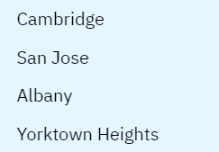

# Is IBM Careers Visual Design that good?

I appreciated the exploration of IBM's career page in the original post and agree with some observations while holding different views on others. Additionally, I noticed a few design elements worth discussing (especially for a company that made [Carbon Design System](https://carbondesignsystem.com/)).

First, I agree that IBM’s logos are clever; the gaps are almost unnoticeable because of how effectively the principles of closure and proximity work together. The structure of the job postings is also well-executed, making it easy for users to find what they are searching for. However, while I initially agreed with the original post’s suggestion, upon realizing the scale of IBM’s listings (over 5000 across 11 categories), I believe chunking the cards based on category might not be the best idea.

Without knowing the specific category a user might be interested in, providing a randomized set of postings and allowing users to filter their preferences is more practical - after all even if the user wants to see only SWE roles they will need to set other preferences like location and experience level to not be bombarded with almost 2000 job postings.

One issue that stood out, which wasn't mentioned in the original post, is how locations are displayed in a given job posting. As you can see in the image below, Cambridge appears visually separated from San Jose, Albany, and Yorktown Heights due to the proximity of the latter three to each other. This difference made me question whether there was something special about Cambridge, but the posting did not clarify this. Even worse, the header of the posting shows all locations with equal proximity, which could mislead users. To improve this, IBM should have more consistent spacing and elaborate on any differentiations made. (Guess we'll never know whether Cambridge is special😔)

|           locations in key job details           |      locations in the header (same posting)       |
| :----------------------------------------------: | :-----------------------------------------------: |
|  |  |

Additionally, there’s confusion in the header because of the use of blue text (which we associate with links) and the proximity principle. Since `See All` was blue and positioned equall close to `Multiple Locations`, `Software Engineering`, and `Intern`, I initially thought all were links. However, none were clickable, except `See All` which was actually a button for viewing locations (there are also a couple of things I do not like on this display since `Software Engineering` and `Intern` drop down and `See All` does not become `See Less`). IBM could have positioned `Multiple Locations` and `See All` closer together or removed the button entirely, as the `key job details` are already distinct from other content and close to the header.

Overall, while IBM’s design makes effective use of Gestalt principles, refining certain elements like element proximity and link differentiation could enhance the user experience further.
